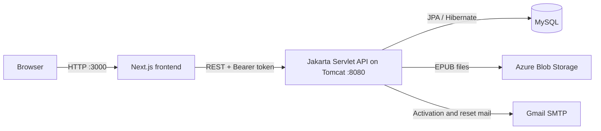

# Comic Reader Site

A full-stack manga and EPUB reading platform with community features and a role-aware administration dashboard.

## Overview

Comic Reader Site is split into two applications:

- `ComicReaderSite/` - a Next.js and TypeScript frontend for readers, community pages, EPUB reading, and administration.
- `Comic/` - a Java 17 backend packaged as a WAR and served by Apache Tomcat. It exposes Servlet-based REST endpoints and uses JPA/Hibernate with MySQL.

The repository implements the two audiences described in [Project_Description.docx](./Project_Description.docx): readers who consume content and administrators who manage the platform. The current code expands staff access into `admin`, `moderator`, and `editor` roles.

## Features

### Reader experience

- Browse, search, sort, and paginate manga.
- View series details, chapters, and chapter images.
- Save bookmarks and reading progress, with a browser-storage fallback.
- Register, sign in, edit a profile, activate an account, and reset a password.
- Upload, manage, and read EPUB files with `epub.js`.
- Create community posts and comments.

### Staff experience

- View dashboard statistics and recent activity.
- Create, update, and delete manga and chapter records.
- Manage users and role assignments.
- Review moderation reports and approval queues.
- Edit system settings.
- Show or hide management actions from resource/action permissions.

> [!NOTE]
> Moderation records, recent activity, parts of the dashboard statistics, and system settings currently use sample or in-memory data. See [Current limitations](#current-limitations) for details.

## Architecture



| Layer | Technology |
| --- | --- |
| Frontend | Next.js 15, React 19, TypeScript 5.9, Tailwind CSS 4 |
| Backend | Java 17, Jakarta EE Web API 11, Jakarta Servlets, Maven |
| Persistence | Hibernate ORM 6.5, JPA 3.1, MySQL Connector/J |
| File reading | `epub.js` |
| File storage | Azure Blob Storage |
| Runtime | Apache Tomcat; Docker images use Tomcat 10.1 |
| Automation | Docker Compose and GitHub Actions for Azure image builds |

## Repository layout

```text
ComicReaderSite/
├── Comic/                         # Java backend
│   ├── src/main/java/.../
│   │   ├── dao/                   # JPA data access
│   │   ├── entity/                # Database entities
│   │   ├── filter/                # CORS filter
│   │   ├── model/                 # API/domain models
│   │   ├── service/               # Authentication and application services
│   │   └── servlet/               # REST endpoints
│   ├── src/main/resources/META-INF/persistence.xml
│   ├── src/main/webapp/WEB-INF/web.xml
│   ├── pom.xml
│   └── dockerfile
├── ComicReaderSite/               # Next.js frontend
│   ├── src/app/                    # App Router pages
│   ├── src/components/             # Shared UI components
│   ├── src/contexts/               # Authentication state
│   ├── src/services/api.ts         # Backend API client
│   ├── src/types/                  # TypeScript domain types
│   ├── package.json
│   └── dockerfile
├── .github/workflows/              # Azure build/deployment workflows
├── docker-compose.yml
├── deployment.md
└── Project_Description.docx        # Project scope and original run guide
```

`Comic/target/` contains generated Maven output. Make backend changes under `Comic/src/`; do not edit compiled classes or the WAR directly.

## Prerequisites

For local development, install:

- Node.js 18.18 or newer and npm.
- JDK 17.
- Maven 3.9 or newer.
- Apache Tomcat 10.1 or newer. The project description recommends Tomcat 11.
- A reachable MySQL 8+ database.

Docker Desktop is optional if you prefer containers.

## Local development

### 1. Configure backend services

The backend currently reads its MySQL connection from:

```text
Comic/src/main/resources/META-INF/persistence.xml
```

Before starting Tomcat, set the JDBC URL, username, and password there for your MySQL instance. Hibernate uses `hibernate.hbm2ddl.auto=update`, so mapped tables are created or updated when the persistence unit starts.

EPUB upload/download and account email flows also depend on Azure Blob Storage and SMTP configuration. If you are not working on those features, the rest of the application can still be developed without exercising those endpoints.

### 2. Build and run the backend

From the repository root:

```powershell
cd Comic
mvn clean package
Copy-Item .\target\Comic.war $env:CATALINA_HOME\webapps\Comic.war
& $env:CATALINA_HOME\bin\catalina.bat run
```

The manually deployed WAR uses the `Comic` context path:

- Health check: `http://localhost:8080/Comic/api/health`
- API base URL: `http://localhost:8080/Comic/api`

Check the backend from PowerShell:

```powershell
Invoke-RestMethod http://localhost:8080/Comic/api/health
```

### 3. Configure and run the frontend

Create `ComicReaderSite/.env.local`:

```dotenv
NEXT_PUBLIC_API_BASE=http://localhost:8080/Comic/api
# Optional comma-separated fallback API bases:
# NEXT_PUBLIC_API_BASE_CANDIDATES=http://localhost:8080/api

# Optional automatic-login override; use a local development account:
# NEXT_PUBLIC_DEFAULT_USERNAME=<development-user>
# NEXT_PUBLIC_DEFAULT_PASSWORD=<development-password>
```

Then install dependencies and start Next.js:

```powershell
cd ComicReaderSite
npm.cmd ci
npm.cmd run dev
```

Open `http://localhost:3000`.

> [!IMPORTANT]
> The frontend contains development-time automatic-login defaults. The backend's demo-user seeding is currently disabled, so automatic login only works when a matching account already exists in the configured database. Override these values locally and never use shared credentials in production.

## Run with Docker Compose

The backend container deploys the WAR as `ROOT.war`, so its containerized API base is `http://localhost:8080/api` rather than `/Comic/api`.

Before building, set this in `ComicReaderSite/.env.local`:

```dotenv
NEXT_PUBLIC_API_BASE=http://localhost:8080/api
```

Then run:

```powershell
docker compose up --build
```

| Service | URL |
| --- | --- |
| Frontend | `http://localhost:3000` |
| Backend health | `http://localhost:8080/api/health` |

Stop the stack with `Ctrl+C`, or use `docker compose down` from another terminal.

## Main application routes

| Route | Purpose |
| --- | --- |
| `/` | Manga catalog, search, sorting, and pagination |
| `/series/[seriesId]` | Series details and chapter list |
| `/series/[seriesId]/[chapterId]` | Image-based chapter reader |
| `/bookmarks` | Saved manga and reading progress |
| `/epub` | Personal EPUB library and uploads |
| `/reader?id=[bookId]` | Paginated EPUB reader |
| `/community` | Community entry page |
| `/community/posts` | Posts and comments |
| `/profile` | Current-user profile |
| `/login`, `/register` | Authentication |
| `/dashboard` | Staff dashboard |
| `/dashboard/manga` | Manga CRUD |
| `/dashboard/manga/manage` | Chapter CRUD |
| `/dashboard/users` | Admin user management |
| `/dashboard/moderation/*` | Reports and approval queues |
| `/dashboard/settings` | Admin settings |

## API overview

All paths below are relative to the active API base (`/Comic/api` for a manual WAR deployment, `/api` for Docker):

| Area | Endpoints |
| --- | --- |
| Health | `GET /health` |
| Authentication | `POST /auth/login`, `POST /auth/logout`, `POST /auth/register`, `GET /auth/me` |
| Account recovery | `GET /auth/activate`, `POST /auth/forgot-password`, `POST /auth/reset-password` |
| Manga | `GET/POST /manga`, `GET/PUT/DELETE /manga/{id}` |
| Chapters | `GET/POST /manga-chapters`, `GET/PUT/DELETE /manga-chapters/{id}` |
| Chapter images | `GET /chapter-images?mangaId=...&chapterId=...` |
| Bookmarks | `GET/POST /bookmarks`, `DELETE /bookmarks/{id}` |
| Reading history | `GET/POST /reading-history`, `DELETE /reading-history/{id}` |
| EPUB | `GET /epub/user/{userId}`, `GET /epub/file?id=...`, `POST /epub`, `DELETE /epub/{id}` |
| Community | `GET/POST /posts`, `GET/POST /comments` |
| Dashboard | `GET /dashboard/stats`, `GET /dashboard/activity` |
| Users | `GET/POST /users`, `GET/PUT/DELETE /users/{id}` |
| Moderation | `GET /moderation/reports`, `GET /moderation/approval`, `PUT /moderation/approval/{id}/{status}` |
| Settings | `GET/PUT /settings` |

Authenticated frontend requests send the token from `localStorage` as `Authorization: Bearer <token>`.

## Roles and permissions

| Role | Intended access |
| --- | --- |
| `admin` | Full manga and user CRUD, dashboard, moderation, and settings |
| `moderator` | Dashboard, manga read/update, and moderation |
| `editor` | Dashboard and manga create/read/update |
| `user` | Reader-facing manga access |

Roles and permissions are created automatically when the roles table is empty. User accounts are not currently seeded automatically.

## Quality checks

Run these before opening a pull request:

```powershell
# Frontend
cd ComicReaderSite
npm.cmd run lint
npm.cmd run build

# Backend
cd ..\Comic
mvn test
mvn clean package
```

There are currently no committed automated test classes, so `mvn test` primarily verifies compilation until tests are added.

## Current limitations

- Authentication tokens are stored in memory and expire after 12 hours; restarting the backend invalidates every session.
- Dashboard activity and some statistics are generated or illustrative rather than fully event-backed.
- Moderation queues and system settings are held in memory and reset when the application restarts.
- Several frontend moderation screens fall back to sample data when the backend is unavailable.
- The forgot-password page currently targets the deployed backend directly, while most other requests use `NEXT_PUBLIC_API_BASE`.
- Frontend role checks improve the interface, but every sensitive backend operation should also enforce authorization before production use.
- No automated frontend or backend tests are currently committed.

## Troubleshooting

### CORS errors

Do not disable browser security. Confirm all three of the following:

1. Tomcat is running and the health endpoint responds.
2. `NEXT_PUBLIC_API_BASE` matches the deployment context (`/Comic/api` locally or `/api` in Docker).
3. The frontend origin is listed in `Comic/src/main/java/reader/site/Comic/filter/CorsFilter.java`.

The current filter allows local frontend ports `3000` and `5173`, plus the configured Azure frontend.

### Backend fails during startup

Check the Tomcat logs for a Hibernate connection error. The application initializes JPA-backed DAOs during servlet startup, so invalid MySQL settings can prevent endpoints from loading.

### EPUB endpoints fail

EPUB metadata is stored in MySQL, while files are stored in Azure Blob Storage. Both services must be reachable and correctly configured.

### A session disappears after restart

This is expected with the current in-memory token service. Sign in again after restarting Tomcat.

## Security notice

The current source contains service credentials in backend configuration classes and `persistence.xml`. Treat them as compromised if this repository has been shared: rotate them, remove them from Git history where appropriate, and move all secrets to environment variables or a secret manager before deployment. Never commit `.env` or `.env.local` files.

## Additional documentation

- [Deployment notes](./deployment.md)
- [Backend migration notes](./Comic/BACKEND_MIGRATION_NOTE.md)
- [Frontend migration guide](./ComicReaderSite/MIGRATION_GUIDE.md)
- [JPA migration guide](./ComicReaderSite/JPA_MIGRATION_GUIDE.md)
- [Dashboard setup notes](./ComicReaderSite/DASHBOARD_SETUP.md)
